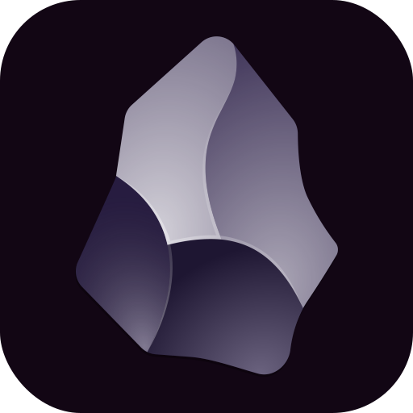

<!-- Improved compatibility of back to top link: See: https://github.com/othneildrew/Best-README-Template/pull/73 -->
<a id="readme-top"></a>
<!--
*** Thanks for checking out the Best-README-Template. If you have a suggestion
*** that would make this better, please fork the repo and create a pull request
*** or simply open an issue with the tag "enhancement".
*** Don't forget to give the project a star!
*** Thanks again! Now go create something AMAZING! :D
-->


<!-- PROJECT SHIELDS -->
<!--
*** I'm using markdown "reference style" links for readability.
*** Reference links are enclosed in brackets [ ] instead of parentheses ( ).
*** See the bottom of this document for the declaration of the reference variables
*** for contributors-url, forks-url, etc. This is an optional, concise syntax you may use.
*** https://www.markdownguide.org/basic-syntax/#reference-style-links
*** The Markdown Links & Immages reference links are at the end of the readme 
-->
[![Contributors][contributors-shield]][contributors-url]
[![Forks][forks-shield]][forks-url]
[![Stargazers][stars-shield]][stars-url]
[![Issues][issues-shield]][issues-url]
[![Unlicense License][license-shield]][license-url]
<!--[![LinkedIn][linkedin-shield]][linkedin-url] -->

<!-- PROJECT LOGO -->
<br />
<div align="center">
  <a href="https://github.com/fab411/Obsidian.desktop/blob/main/obsidian/images/obsidian_core.svg">
    
  </a>

  <h3 align="center">Creating a .desktop File for Application Shortcuts</h3>
  <p align="center">
    An awesome README to run Obsidian via the graphical interface and make the work process smoother
    <br />
    <a href="https://github.com/fab411/Obsidian.desktop"><strong>Explore the docs »</strong></a>
    <br />
    <br />
    <a href="https://github.com/fab411/Obsidian.desktop">View Demo</a>
    &middot;
    <a href="https://github.com/fab411/Obsidian.desktop/issues/new?labels=bug&template=bug-report---.md">Report Bug</a>
    &middot;
    <a href="https://github.com/fab411/Obsidian.desktop/issues/new?labels=enhancement&template=feature-request---.md">Request Feature</a>
  </p>
</div>

<!-- TABLE OF CONTENTS -->
<details>
  <summary>Table of Contents</summary>
  <ol>
    <li>
      <a href="#about-the-project">About The Project</a>
      <!--<ul>
        <li><a href="#built-with">Built With</a></li>
      </ul>-->
    </li>
    <li>
      <a href="#getting-started">Getting Started</a>
      <!--<ul>
        <li><a href="#prerequisites">Prerequisites</a></li>
        <li><a href="#installation">Installation</a></li>
      </ul>-->
    </li>
    <li><a href="#usage">Usage</a></li>
    <li><a href="#links">Useful Links</a></li>
    <li><a href="#contributing">Contributing</a></li>
    <li><a href="#license">License</a></li>
    <li><a href="#contact">Contact</a></li>
    <li><a href="#acknowledgments">Acknowledgments</a></li>
  </ol>
</details>


# Obsidian.desktop File for Application Shortcut

## About The Project

This guide helps you create a User-specific `.desktop` file in to add an application shortcut to your Linux desktop environment (GNOME, KDE, XFCE, etc.). Once added, the shortcut will be searchable using the **Super key**, and you can pin it to favorites.

<p align="right">(<a href="#readme-top">back to top</a>)</p>


<!--
### Built With

This section should list any major frameworks/libraries used to bootstrap your project. Leave any add-ons/plugins for the acknowledgements section. Here are a few examples.

* [![Next][Next.js]][Next-url]
* [![React][React.js]][React-url]
* [![Vue][Vue.js]][Vue-url]
* [![Angular][Angular.io]][Angular-url]
* [![Svelte][Svelte.dev]][Svelte-url]
* [![Laravel][Laravel.com]][Laravel-url]
* [![Bootstrap][Bootstrap.com]][Bootstrap-url]
* [![JQuery][JQuery.com]][JQuery-url]

<p align="right">(<a href="#readme-top">back to top</a>)</p>
-->


### Step 1: Clone the Repository
&nbsp; First, download the repository to your local machine:
```bash
git clone https://github.com/fab411/Obsidian.desktop
cd Obsidian.desktop
```

### Step 2: Download Obsidian .AppImage 
&nbsp; This repository does **not** include the Obsidian `.AppImage` file to keep the project lightweight.  
To get the correct version, follow the instructions in [`obsidian/images/Obsidian-1.8.7.AppImage.placeholder`](obsidian/images/Obsidian-1.8.7.AppImage.placeholder).
    

<!--3️-->
### Step 3: Place the File in the Correct Directory 
&nbsp; After downloading `Obsidian-1.8.7.AppImage`, move it to the required location:
```bash
mv Obsidian-1.8.7.AppImage ~/.local/share/obsidian/
```

### Step 4: Install the .desktop File
&nbsp; To install the file, run:
```bash 
sudo desktop-file-install --dir=$HOME/.local/share/applications $HOME/.local/share/obsidian/Obsidian.desktop
```


### Step 5: Update the Application Database
&nbsp; Update the application database so the new shortcut is recognized:
```bash 
sudo update-desktop-database ~/.local/share/applications/
```
&nbsp; The `Obsidian.desktop` file should be stored in:
```bash
ls ~/.local/share/applications/
```

<p align="right">(<a href="#readme-top">back to top</a>)</p>


## Usage
After completing the above steps, you can:
 - [x] Launch Obsidian from your application menu.
 - [x] Pin it to your favorites for quick access.

Let me know if you need help with anything else!

<p align="right">(<a href="#readme-top">back to top</a>)</p>


<!-- Troubleshooting -->
## Troubleshooting
Make sure the `.AppImage` file is executable:
```bash
chmod +x ~/.local/share/obsidian/Obsidian-1.8.7.AppImage
```
<p align="right">(<a href="#readme-top">back to top</a>)</p>


<!-- CONTRIBUTING -->
## Contributing

Contributions are what make the open source community such an amazing place to learn, inspire, and create. Any contributions you make are **greatly appreciated**.

If you have a suggestion that would make this better, please fork the repo and create a pull request. You can also simply open an issue with the tag "enhancement".
Don't forget to give the project a star! Thanks again!

1. Fork the Project
2. Create your Feature Branch (`git checkout -b feature/AmazingFeature`)
3. Commit your Changes (`git commit -m 'Add some AmazingFeature'`)
4. Push to the Branch (`git push origin feature/AmazingFeature`)
5. Open a Pull Request

### Top :

<a href="https://github.com/fab411/Obsidian.desktop/graphs/contributors">
  
</a>

<p align="right">(<a href="#readme-top">back to top</a>)</p>


<!-- LICENSE -->
## License

Distributed under the Unlicense License. See `LICENSE.txt` for more information.

<p align="right">(<a href="#readme-top">back to top</a>)</p>


<!-- CONTACT -->
## Contact

Fabian Lang - FabianLang@posteo.net <!--[@your_twitter](https://twitter.com/your_username)-->

Project Link: [https://github.com/fab411/Obsidian.desktop](https://github.com/fab411/Obsidian.desktop)


<!--https://github.com/fab411/Obsidian.desktop/blob/main/README.md-->

<p align="right">(<a href="#readme-top">back to top</a>)</p>


<!-- ACKNOWLEDGMENTS -->
## Acknowledgments

Use this space to list resources you find helpful and would like to give credit to. I've included a few of my favorites to kick things off!

* [Obsidian Forum](https://forum.obsidian.md/) 
* [Icon randomizer](https://obsidian.md/blog/new-obsidian-icon/)
* [Desktop Entry Specifications](https://specifications.freedesktop.org/desktop-entry-spec/latest/)
* [Desktop Entry explanations](https://www.baeldung.com/linux/desktop-entry-files)
* [`desktop-file-install` Arguments](https://www.commandlinux.com/man-page/man1/desktop-file-install.1.html)
* [Choose an Open Source License](https://choosealicense.com)
* [GitHub Pages](https://pages.github.com)
* [Img Shields](https://shields.io)
* [React Icons](https://react-icons.github.io/react-icons/search)

<p align="right">(<a href="#readme-top">back to top</a>)</p>

<!--ROADMAP--> 
## Roadmap

- [x] Add Changelog
- [x] Add AppImage Stuff
- [x] Add Acknowledgments
- [x] Repository Structure
- [ ] Modify file paths to be more generic and avoid hardcoded /home/fab/ paths
    - [ ] .desktop files and compatibility
- [ ] Update Table of Contents
- [ ] Add "components" document to easily copy & paste sections of the readme
- [ ] Multi-language Support
    - [ ] German
    - [ ] Arabic
- [ ] Docker

See the [open issues](https://github.com/othneildrew/Best-README-Template/issues) for a full list of proposed features (and known issues).

<p align="right">(<a href="#readme-top">back to top</a>)</p>


<!--* * [Font Awesome](https://fontawesome.com)
  * * [Malven's Flexbox Cheatsheet](https://flexbox.malven.co/)
* [Malven's Grid Cheatsheet](https://grid.malven.co/
* [GitHub Emoji Cheat Sheet](https://www.webpagefx.com/tools/emoji-cheat-sheet)-->


<!-- MARKDOWN LINKS & IMAGES -->
[repo]: https://github.com/fab411/Obsidian.desktop
[link]: fab411/Obsidian.desktop
<!-- https://www.markdownguide.org/basic-syntax/#reference-style-links -->
[contributors-shield]: https://img.shields.io/github/contributors/othneildrew/Best-README-Template.svg?style=for-the-badge
[contributors-url]: https://github.com/fab411/Obsidian.desktop/graphs/contributors
[forks-shield]: https://img.shields.io/github/forks/fab411/Obsidian.desktop.svg?style=for-the-badge
[forks-url]: https://github.com/fab411/Obsidian.desktop/network/members
[stars-shield]: https://img.shields.io/github/stars/fab411/Obsidian.desktop.svg?style=for-the-badge
[stars-url]: https://github.com/fab411/Obsidian.desktop/stargazers
[issues-shield]: https://img.shields.io/github/issues/fab411/Obsidian.desktop.svg?style=for-the-badge
[issues-url]: https://github.com/fab411/Obsidian.desktop/issues
[license-shield]: https://img.shields.io/github/license/fab411/Obsidian.desktop.svg?style=for-the-badge
[license-url]: https://github.com/fab411/Obsidian.desktop/blob/master/LICENSE.txt
[linkedin-shield]: https://img.shields.io/badge/-LinkedIn-black.svg?style=for-the-badge&logo=linkedin&colorB=555
[linkedin-url]: https://linkedin.com/in/othneildrew

<!--
[Next.js]: https://img.shields.io/badge/next.js-000000?style=for-the-badge&logo=nextdotjs&logoColor=white
[Next-url]: https://nextjs.org/
[React.js]: https://img.shields.io/badge/React-20232A?style=for-the-badge&logo=react&logoColor=61DAFB
[React-url]: https://reactjs.org/
[Vue.js]: https://img.shields.io/badge/Vue.js-35495E?style=for-the-badge&logo=vuedotjs&logoColor=4FC08D
[Vue-url]: https://vuejs.org/
[Angular.io]: https://img.shields.io/badge/Angular-DD0031?style=for-the-badge&logo=angular&logoColor=white
[Angular-url]: https://angular.io/
[Svelte.dev]: https://img.shields.io/badge/Svelte-4A4A55?style=for-the-badge&logo=svelte&logoColor=FF3E00
[Svelte-url]: https://svelte.dev/
[Laravel.com]: https://img.shields.io/badge/Laravel-FF2D20?style=for-the-badge&logo=laravel&logoColor=white
[Laravel-url]: https://laravel.com
[Bootstrap.com]: https://img.shields.io/badge/Bootstrap-563D7C?style=for-the-badge&logo=bootstrap&logoColor=white
[Bootstrap-url]: https://getbootstrap.com
[JQuery.com]: https://img.shields.io/badge/jQuery-0769AD?style=for-the-badge&logo=jquery&logoColor=white
[JQuery-url]: https://jquery.com 
[forks-url]: https://github.com/othneildrew/Best-README-Template/network/members
[stars-shield]: https://img.shields.io/github/stars/othneildrew/Best-README-Template.svg?style=for-the-badge
[stars-url]: https://github.com/othneildrew/Best-README-Template/stargazers
[issues-shield]: https://img.shields.io/github/issues/othneildrew/Best-README-Template.svg?style=for-the-badge
[issues-url]: https://github.com/othneildrew/Best-README-Template/issues
[license-shield]: https://img.shields.io/github/license/othneildrew/Best-README-Template.svg?style=for-the-badge
[license-url]: https://github.com/othneildrew/Best-README-Template/blob/master/LICENSE.txt
[linkedin-shield]: https://img.shields.io/badge/-LinkedIn-black.svg?style=for-the-badge&logo=linkedin&colorB=555
[linkedin-url]: https://linkedin.com/in/othneildrew
[product-screenshot]: images/screenshot.png
[Next.js]: https://img.shields.io/badge/next.js-000000?style=for-the-badge&logo=nextdotjs&logoColor=white
[Next-url]: https://nextjs.org/
[React.js]: https://img.shields.io/badge/React-20232A?style=for-the-badge&logo=react&logoColor=61DAFB
[React-url]: https://reactjs.org/
[Vue.js]: https://img.shields.io/badge/Vue.js-35495E?style=for-the-badge&logo=vuedotjs&logoColor=4FC08D
[Vue-url]: https://vuejs.org/
[Angular.io]: https://img.shields.io/badge/Angular-DD0031?style=for-the-badge&logo=angular&logoColor=white
[Angular-url]: https://angular.io/
[Svelte.dev]: https://img.shields.io/badge/Svelte-4A4A55?style=for-the-badge&logo=svelte&logoColor=FF3E00
[Svelte-url]: https://svelte.dev/
[Laravel.com]: https://img.shields.io/badge/Laravel-FF2D20?style=for-the-badge&logo=laravel&logoColor=white
[Laravel-url]: https://laravel.com
[Bootstrap.com]: https://img.shields.io/badge/Bootstrap-563D7C?style=for-the-badge&logo=bootstrap&logoColor=white
[Bootstrap-url]: https://getbootstrap.com
[JQuery.com]: https://img.shields.io/badge/jQuery-0769AD?style=for-the-badge&logo=jquery&logoColor=white
[JQuery-url]: https://jquery.com 
-->
